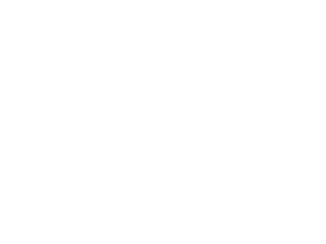

# 📊 Análise do Brasileirão com Python

Projeto de análise exploratória de dados do Campeonato Brasileiro utilizando Python.

## 🔧 Ferramentas
- Python
- Pandas
- Matplotlib

## 📁 Estrutura
- data/raw → base original
- data/processed → dados tratados
- notebooks → análises
- images → gráficos

## 📊 Análises realizadas
- Média de gols por temporada
- Resultados (casa x fora)
- Ranking de ataques
- Ranking de defesas
- Evolução temporal do campeonato

## 📈 Principais insights
- Redução da média de gols entre 2012–2018
- Tendência de crescimento após 2020
- Alta competitividade entre equipes

## 📸 Exemplo
